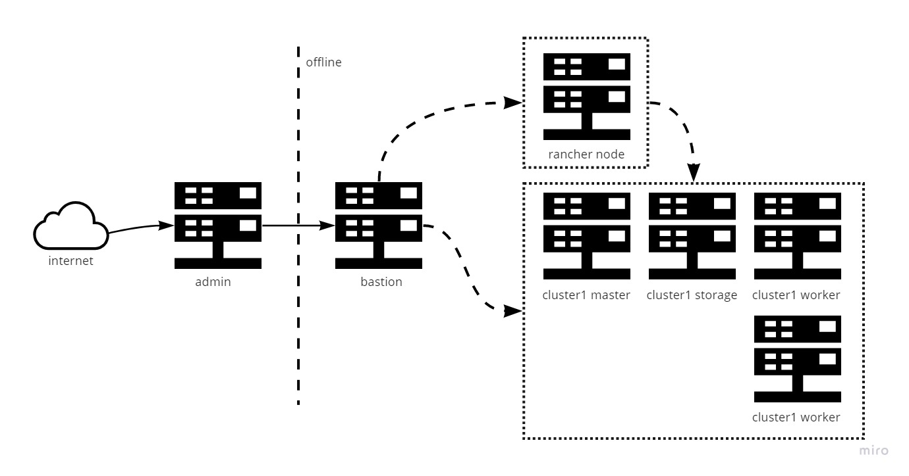

You need
- vm with internet and bastion access
- docker on this vm
- 60Gb+ on vm and bastion




```
Usage:
    -o creating data on local with internet
    -i creating tar.gz from offline-images.txt
    -b Upload data to bastion server  by $BASTION_SCP
    -p Start instalation on bastion $BASTION_HOST
```


### Docs
---

#### Preapare ADMIN
- install docker on VM with internet (next ADMIN vm)
```
curl https://releases.rancher.com/install-docker/19.03.sh | sh
```
- on ADMIN should be with access to offline bastion 

```
sudo docker build -t online https://github.com/Negashev/rancher-offline-installation.git#main && \
sudo docker run -it --rm \
-v /var/run:/var/run \
-v /var/online_bastion:/tmp \
-e HOST_MOUNT=/var/online_bastion \
-e BASTION_HOST=10.0.10.10 \
-e BASTION_USER=username \
-e BASTION_SCP='sshpass -p "passw0rd" scp -oStrictHostKeyChecking=no -r {source} {user}@{host}:{destination}' \
-e BASTION_SSH_RUN='echo "passw0rd" | sshpass -p "passw0rd" ssh -oStrictHostKeyChecking=no  -oPasswordAuthentication=yes  {user}@{host}' \
--privileged \
online -b -o -p -i
```
---
#### Check the bastion
- on bastion `docker ps` show 3 containers
```
registry
bastion-static
chartmuseum
```
---
#### Start offline installation (from bastion)
- on bastion, cp terragrunt data
```
# store all terragrunt data on bastion
sudo docker run -it --rm -v /var/terragrunt:/mount -w /terragrunt terragrunt cp -r ./ /mount/
```
- on bastion, provision all nodes offline
```
sudo docker run -it --rm -v /var/terragrunt:/mount -w /mount terragrunt \
-e TF_VAR_bastion_host=10.10.10.10 \
-e TF_VAR_ssh_password=passw0rd \
-e TF_VAR_ssh_user=username \
-e TF_VAR_rancher_nodes='["0.0.0.1","0.0.0.2","0.0.0.3"]' \
-e TF_VAR_rancher_hostname=my.company.com \
-e TF_VAR_rancher_password=Rancher-passw0rd \
-e TF_VAR_cluster_nodes='{"brain":["0.0.0.4","0.0.0.5","0.0.0.6"],"storage":["0.0.0.7","0.0.0.8","0.0.0.9"],"worker":["0.0.0.10","0.0.0.11","0.0.0.12"]}' \
terragrunt run-all apply
